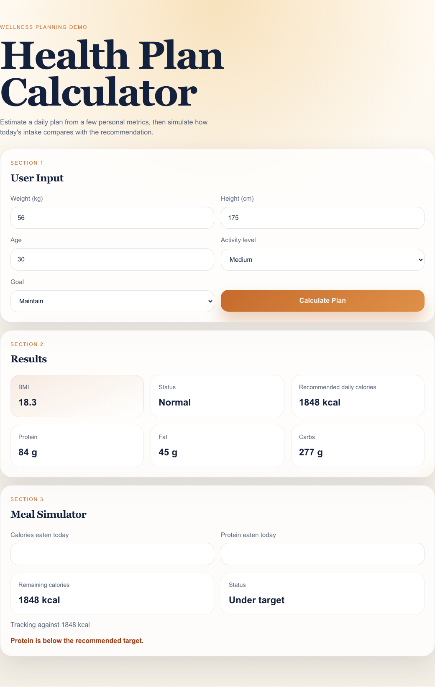
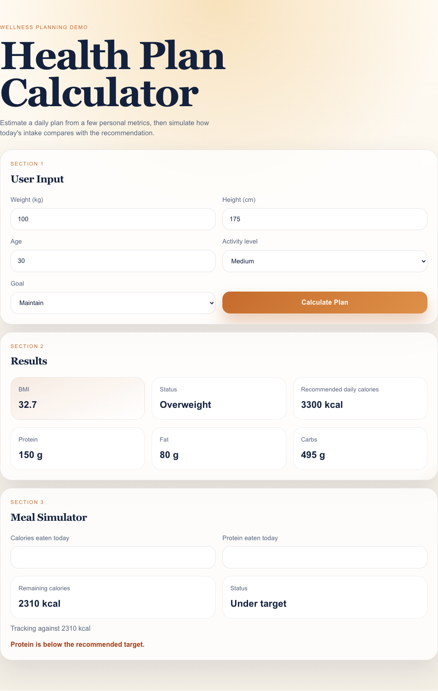
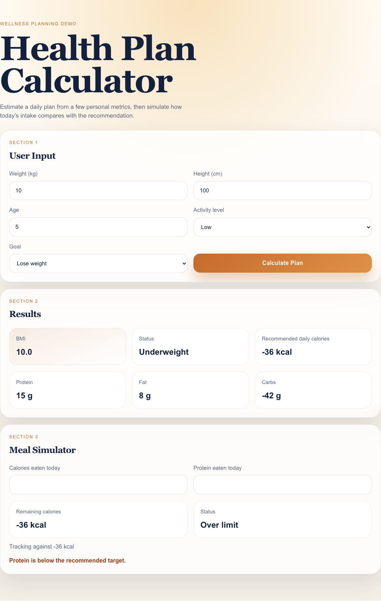
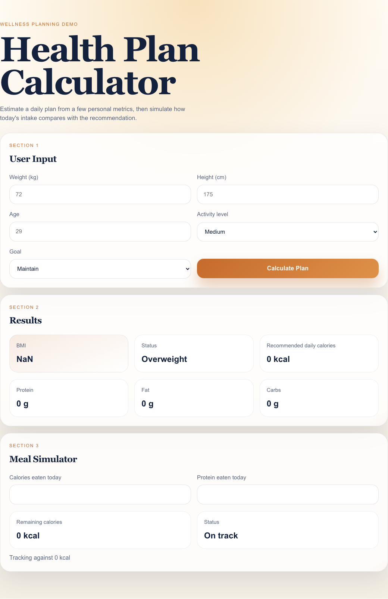

# Bug Report — Health Plan Calculator

**Project:** Health Plan Calculator
**Date:** 2026-04-02
**Tester:** Eduard
**Environment:** macOS, Node 22+, Chrome/Safari, React 19 + Vite 6 + TypeScript 5.8

---

## Executive Summary

**7 bugs found** across calculator logic, UI state management, and input handling.

| Severity | Count |
|----------|-------|
| Critical | 1 |
| Major | 4 |
| Minor | 2 |

**Key risks:** Incorrect health recommendations due to wrong BMI classification thresholds and ignored age factor. Users with BMI between 18.0–18.4 are told they are "Normal" when WHO standards classify them as "Underweight." Meal Simulator shows stale data after recalculation, misleading users about their daily targets.

---

## Bugs

### BUG-001: BMI classification thresholds deviate from WHO standards

**Severity:** Critical | **Priority:** P1

**Steps to reproduce:**
1. Enter weight: 57 kg, height: 175 cm (BMI ≈ 18.61)
2. Click "Calculate Plan"
3. Observe the Status field
4. Now try weight: 56 kg, height: 175 cm (BMI ≈ 18.29)
5. Click "Calculate Plan"
6. Observe the Status field

**Expected:** BMI 18.29 → "Underweight" (WHO: Underweight is < 18.5)
**Actual:** BMI 18.29 → "Normal" (code uses threshold < 18 instead of < 18.5)

Similarly:
- BMI 24.5 → should be "Normal" (WHO: Normal is 18.5–24.9) but app says "Overweight" (code uses < 24 instead of < 25)

**Spec reference:** CLAUDE.md: "BMI status based on standard WHO ranges (Underweight < 18.5, Normal 18.5-24.9, Overweight >= 25)"

**Test reference:** `calculator.bugs.test.ts` — "should classify BMI 18.3 as Underweight per WHO standards"

**Screenshot:** 
*BMI 18.3 (weight=56, height=175) classified as "Normal" — should be "Underweight" per WHO.*

**Risk assessment:** Users in the 18.0–18.4 BMI range receive incorrect health guidance. A person who is medically underweight is told they are "Normal," potentially delaying intervention. Similarly, BMI 24.0–24.9 users are told "Overweight" when they are within normal range, causing unnecessary concern. In a real health application this could have serious medical implications.

---

### BUG-002: Meal Simulator uses stale calorie/protein targets after recalculation

**Severity:** Major | **Priority:** P1

**Steps to reproduce:**
1. Enter weight: 70, height: 175, age: 30, activity: Medium, goal: Maintain
2. Click "Calculate Plan" — results show 2310 kcal
3. Change weight to 100
4. Click "Calculate Plan" — results card updates to 3300 kcal
5. Observe the Meal Simulator "Tracking against" line

**Expected:** "Tracking against 3300 kcal"
**Actual:** "Tracking against 2310 kcal"

The MealSimulator component initializes `targetCalories` and `targetProtein` with `useState(recommendedCalories)` and `useState(recommendedProtein)`. React's `useState` only uses the argument as the *initial* value — subsequent prop changes are ignored.

**Spec reference:** CLAUDE.md: "Meal Simulator should use the **latest** calculated plan values"

**Test reference:** `App.bugs.test.ts` — "should update simulator targets when plan is recalculated"

**Risk assessment:** Users who recalculate their plan (e.g., after correcting a typo in weight) see updated results but the simulator still tracks against old values. The "Over limit" / "Under target" status becomes meaningless. Particularly dangerous if a user's actual target is much higher/lower than the stale one.

**Screenshot:** 
*Results card shows 3300 kcal but Meal Simulator still says "Tracking against 2310 kcal."*

**Note:** The existing test `"keeps simulator targets stale after a second calculation"` asserts this broken behavior as correct.

---

### BUG-003: Age is collected but never used in calculations

**Severity:** Major | **Priority:** P2

**Steps to reproduce:**
1. Enter weight: 70, height: 175, age: 25, activity: Medium, goal: Maintain
2. Click "Calculate Plan" — note the calorie value
3. Change age to 65
4. Click "Calculate Plan" — note the calorie value

**Expected:** Different calorie recommendations for a 25-year-old vs a 65-year-old
**Actual:** Identical results (2310 kcal for both)

The `calculateCalories` function signature is `(weight, activityLevel, goal)` — it does not accept an age parameter. The `calculatePlan` function extracts `age` from form values but never passes it to any calculation.

**Spec reference:** The form collects age as a required input, implying it should affect the output.

**Test reference:** `calculator.bugs.test.ts` — "should produce different calorie targets for different ages"

**Risk assessment:** A 20-year-old and an 80-year-old with identical weight/height/activity/goal receive the same calorie recommendation. This is medically inaccurate — basal metabolic rate decreases with age. Users may distrust the tool when they realize age has no effect.

---

### BUG-004: Calorie calculation can produce negative values

**Severity:** Major | **Priority:** P2

**Steps to reproduce:**
1. Enter weight: 10, height: 100, age: 5, activity: Low, goal: Lose weight
2. Click "Calculate Plan"

**Expected:** A reasonable minimum calorie value (or validation preventing this input)
**Actual:** Calories = -36 kcal (10 × 22 × 1.2 + (-300) = -36)

**Spec reference:** No explicit minimum stated, but negative calories are physically meaningless.

**Test reference:** `calculator.bugs.test.ts` — "should never return negative calorie values"

**Screenshot:** 
*Weight=10, Low activity, Lose weight → -36 kcal calories and -42g carbs.*

**Risk assessment:** Displaying negative calories is confusing and medically dangerous if taken literally. The downstream macro calculation also breaks — negative calories produce negative carb values. In a real health app, this could lead to harmful dietary advice.

---

### BUG-005: No input validation — NaN, Infinity, and empty submissions accepted

**Severity:** Major | **Priority:** P2

**Steps to reproduce:**
1. Leave all fields empty, click "Calculate Plan"
2. Or enter "abc" in the weight field, click "Calculate Plan"
3. Or enter 0 in the height field, click "Calculate Plan"

**Expected:** Validation error message; no calculation performed
**Actual:**
- Empty fields → BMI: NaN, Calories: NaN
- "abc" in weight → BMI: NaN, Calories: NaN
- Height = 0 → BMI: Infinity

**Test reference:** `App.bugs.test.ts` — "should show validation error when submitting empty form"

**Screenshot:** 
*Empty form submitted — BMI shows "NaN", calories show "0 kcal".*

**Risk assessment:** Users see "NaN" or "Infinity" displayed in the results, which is a poor user experience and erodes trust. No input sanitization means any string is accepted. Zero height causes a division-by-zero producing Infinity BMI.

---

### BUG-006: Existing test suite validates bugs as correct behavior

**Severity:** Minor | **Priority:** P3

**Details:**
Two tests in the existing suite assert that buggy behavior is the expected outcome:

1. `calculator.test.ts:14` — `"uses the intentionally wrong bmi thresholds from the brief"` — asserts `calculateStatus(18)` is "Normal" and `calculateStatus(24)` is "Overweight", which contradicts the WHO thresholds stated in the spec.

2. `App.test.ts:22` — `"keeps simulator targets stale after a second calculation"` — asserts that after recalculation, the simulator still tracks against the old (2310 kcal) value, directly contradicting the spec requirement for "latest" values.

**Risk assessment:** These tests create a false sense of correctness. A developer running `npm test` sees all green and assumes the app works correctly. The tests actively prevent bug detection through TDD/regression — fixing the bugs would cause these tests to fail.

---

### BUG-007: Inputs use `type="text"` instead of `type="number"`

**Severity:** Minor | **Priority:** P3

**Details:**
All numeric input fields (weight, height, age) use `type="text"`:
- `UserForm.tsx:35` — weight input
- `UserForm.tsx:47` — height input
- `UserForm.tsx:59` — age input

**Expected:** `type="number"` with appropriate `min`/`max`/`step` attributes
**Actual:** `type="text"` — accepts any characters

**Risk assessment:** On mobile devices, users get a full keyboard instead of a numeric keypad. Non-numeric input is silently accepted and converted to NaN by `Number()`. This is both a UX issue and contributes to BUG-005.

---

## Improvement Suggestions

| ID | Improvement | Rationale | Effort |
|----|-------------|-----------|--------|
| IMP-001 | Add loading spinner during 700ms calculation delay | Users see a blank gap after clicking Calculate — feels broken | Low |
| IMP-002 | Clear/update results when form values change | Stale results from previous calculation are confusing | Low |
| IMP-003 | Add form reset button | No way to start over without page refresh | Low |
| IMP-004 | Show protein remaining (not just warning) in MealSimulator | Calorie remaining is shown as a number; protein only gets a warning | Low |
| IMP-005 | Display BMI category with color coding | Visual indicator makes status more scannable | Med |
| IMP-006 | Add input min/max constraints | Prevent absurd values like weight=9999 or age=0 | Low |
| IMP-007 | Remove artificial async delay | `setTimeout(700)` wrapping a synchronous calculation serves no purpose, worsens UX | Low |
| IMP-008 | Responsive font sizing on stat cards | Numbers can overflow containers on narrow mobile screens | Low |
